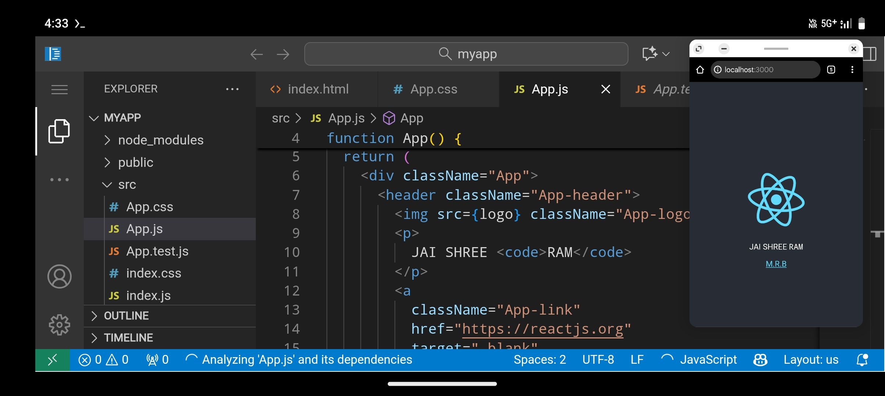

# Termux-vs-code-and-React-Setup-on-android
<code>You can install vs code and React in Termux in Just Few Commands And Enjoy Creating Beautiful and Advance Website on Vs code + React</code>





@SCRIPT UPDATE SETUP IN 1 COMMAND ONLY@


```bash
# होम डायरेक्टरी में जाएँ
cd ~

# UI के लिए आवश्यक यूटिलिटीज़ इंस्टॉल करें
pkg install ncurses-utils figlet -y > /dev/null 2>&1

# 1. इंस्टॉलेशन और अनइंस्टॉल लॉजिक के लिए स्क्रिप्ट फ़ाइल बनाएँ (mrb_setup_ultimate.sh)
cat << 'SETUP_LOGIC_EOF' > mrb_setup_ultimate.sh
#!/bin/bash

# --- GLOBAL VARIABLES & COLORS ---
R='\033[1;31m'; G='\033[1;32m'; Y='\033[1;33m'; C='\033[1;36m'; W='\033[1;37m'; B='\033[1;34m'; RESET='\033[0m'
STATUS_FILE=~/.mrb_install_status
TOTAL_STEPS=11

# --- UI Functions ---
show_header_install() {
    clear
    echo -e "$R=================================================="
    figlet -f big "MRB DEV"
    echo -e "$W==================================================$RESET"
    echo -e "$Y    🛠️ MRB SYSTEM - AUTOMATIC SETUP 🛠️$RESET"
    echo -e "$W==================================================$RESET"
}

# लोडिंग स्क्रीन फंक्शन
loading_screen() {
    clear
    echo -e "$R=================================================="
    figlet -f big "  LOADING"
    echo -e "$W==================================================$RESET"
    echo -e "$C\n\t🚀 AUTOMATIC SETUP SHURU HO RAHA HAI...$RESET"
    echo -e "$Y\tKripya intazaar karein, yeh ab $Gbilkul nahi atkega$Y.$RESET"
    echo -e "$R==================================================$RESET"
    sleep 3
}

# प्रोग्रेस बार फंक्शन
show_progress() {
    local current=$1
    local total=$2
    local task_name="$3"
    
    local width=30
    local complete=$(( (current * width) / total ))
    local remaining=$(( width - complete ))
    
    local progress_bar=""
    for i in $(seq 1 $complete); do progress_bar+="#"; done
    for i in $(seq 1 $remaining); do progress_bar+="-"; done
    
    local percent=$(( (current * 100) / total ))
    
    show_header_install
    echo -e "$Y[ $current/$total ] $W$task_name $CProcessing...$RESET"
    echo -e "$R"
    echo "  [$progress_bar] $percent%"
    echo -e "$RESET"
    echo -e "$W--------------------------------------------------$RESET"
}

# --- UNINSTALLATION/RESET FUNCTION ---
uninstall_system() {
    clear
    echo -e "$R=================================================="
    echo -e "$R     ⚠️ MRB SYSTEM UNINSTALLATION ⚠️$RESET"
    echo -e "$W==================================================$RESET"

    read -r -p "$(echo -e "$R Kya aap system ko puri tarah se hatana chahte hain? (y/N): $RESET")" confirm
    if [[ $confirm != [yY] ]]; then
        return 0
    fi

    echo -e "$Y[*] Running command: Stopping running services...$RESET"
    pkill -f code-server
    pkill -f node
    
    echo -e "$Y[*] Running command: Removing installed files and configs...$RESET"
    rm -rf ~/myapp
    rm -f ~/.config/code-server/config.yaml
    rm -f $STATUS_FILE
    
    # Remove auto-launch from .bashrc
    sed -i '/mrb_ui/d' ~/.bashrc
    
    echo -e "$G[✔] SUCCESS: MRB SYSTEM successfully uninstalled.$RESET"
    echo -e "$Y[!] Ab Termux ko band karke firse khole ($RRESTART$Y) takki sab kuch hat jaye.$RESET"
    read -p "Press Enter to continue..."
    return 0
}


# --- AUTOMATIC INSTALLATION FUNCTION (11 Steps) ---
auto_install_system() {
    loading_screen
    
    # Reset status file
    echo 0 > $STATUS_FILE
    
    local i=1
    local total=$TOTAL_STEPS
    
    # Function to display error and pause
    handle_error() {
        echo -e "$R[X] FAILED on Step $i: $1 $RESET"
        echo -e "$Y[!] Termux prompt par wapas jaane ke liye enter dabayein aur error messages check karein ya Option 5 se Uninstall karein.$RESET"
        read -p "Press Enter to go to Terminal..."
        return 1
    }

    # 1. Termux Storage
    show_progress $i $total "📂 Step 1: Termux Storage Access (termux-setup-storage)"
    termux-setup-storage > /dev/null 2>&1
    if [ $? -ne 0 ]; then
        handle_error "Storage access nahi mila. Termux-setup-storage manually chalaayein aur 'Allow' karein." && return $?
    fi
    echo -e "$G[✔] SUCCESS: Storage access granted.$RESET"; i=$((i+1)); echo $i > $STATUS_FILE; sleep 1
    
    # 2. Update (Using yes | for guaranteed non-interactive update)
    show_progress $i $total "🔄 Step 2: System Packages Update (yes | pkg update)"
    yes | pkg update -y > /dev/null 2>&1
    if [ $? -ne 0 ]; then
        handle_error "Package update fail ho gaya. Internet connection check karein." && return $?
    fi
    echo -e "$G[✔] SUCCESS: System packages updated.$RESET"; i=$((i+1)); echo $i > $STATUS_FILE; sleep 1

    # 3. Upgrade (Using yes | for guaranteed non-interactive upgrade)
    show_progress $i $total "⬆️ Step 3: System Packages Upgrade (yes | pkg upgrade)"
    yes | pkg upgrade -y > /dev/null 2>&1
    if [ $? -ne 0 ]; then
        handle_error "Upgrade fail ho gaya. 'pkg upgrade -y' manually chalaayein." && return $?
    fi
    echo -e "$G[✔] SUCCESS: System packages upgraded.$RESET"; i=$((i+1)); echo $i > $STATUS_FILE; sleep 1
    
    # 4. Tur-Repo (Using yes |)
    show_progress $i $total "🛠️ Step 4: Tur-Repo Installation (yes | pkg install tur-repo)"
    yes | pkg install tur-repo -y > /dev/null 2>&1
    if [ $? -ne 0 ]; then
        handle_error "Tur-Repo install fail ho gaya. 'pkg install tur-repo' manually chalaayein." && return $?
    fi
    echo -e "$G[✔] SUCCESS: Tur-Repo installed.$RESET"; i=$((i+1)); echo $i > $STATUS_FILE; sleep 1

    # 5. Apt Refresh (Critical Fix)
    show_progress $i $total "✅ Step 5: Apt/Pkg List Refresh (Critical Code-Server Fix)"
    pkg update -y > /dev/null 2>&1 
    if [ $? -ne 0 ]; then
        handle_error "Package list refresh fail ho gaya. 'pkg update' manually chalaayein." && return $?
    fi
    echo -e "$G[✔] SUCCESS: Package list refreshed.$RESET"; i=$((i+1)); echo $i > $STATUS_FILE; sleep 1

    # 6. Core Tools (Node, Git, Yarn) (Using yes |)
    show_progress $i $total "📦 Step 6: Installing Node.js, Git, Yarn (yes | pkg install nodejs git yarn)"
    yes | pkg install nodejs git yarn -y > /dev/null 2>&1
    if [ $? -ne 0 ]; then
        handle_error "Core tools (Node/Git/Yarn) install fail ho gaya. Dependencies check karein." && return $?
    fi
    echo -e "$G[✔] SUCCESS: Node.js, Git, and Yarn installed.$RESET"; i=$((i+1)); echo $i > $STATUS_FILE; sleep 1
    
    # 7. Code-Server (Using yes |)
    show_progress $i $total "🖥️ Step 7: Installing Code-Server (yes | pkg install code-server)"
    yes | pkg install code-server -y > /dev/null 2>&1
    if [ $? -ne 0 ]; then
        handle_error "Code-Server installation fail ho gaya. 'pkg install code-server' manually chalaayein." && return $?
    fi
    echo -e "$G[✔] SUCCESS: Code-Server installed.$RESET"; i=$((i+1)); echo $i > $STATUS_FILE; sleep 1
    
    # 8. Code-Server Config
    show_progress $i $total "⚙️ Step 8: Configuring Code-Server (No Password on 8080)"
    mkdir -p ~/.config/code-server > /dev/null 2>&1
    echo "bind-addr: 127.0.0.1:8080" > ~/.config/code-server/config.yaml
    echo "auth: none" >> ~/.config/code-server/config.yaml
    echo "cert: false" >> ~/.config/code-server/config.yaml
    if [ $? -ne 0 ]; then
        handle_error "Configuration file likhne mein error. Permissions check karein." && return $?
    fi
    echo -e "$G[✔] SUCCESS: Code-Server configured.$RESET"; i=$((i+1)); echo $i > $STATUS_FILE; sleep 1

    # 9. Global React Tool (NPM)
    show_progress $i $total "⚛️ Step 9: Installing global React tool (npm install -g create-react-app)"
    npm install -g create-react-app > /dev/null 2>&1
    if [ $? -ne 0 ]; then
        handle_error "Global npm install fail ho gaya. 'npm install -g create-react-app' manually chalaayein." && return $?
    fi
    echo -e "$G[✔] SUCCESS: create-react-app installed.$RESET"; i=$((i+1)); echo $i > $STATUS_FILE; sleep 1

    # 10. React App Creation
    show_progress $i $total "⚛️ Step 10: Creating initial React App (create-react-app myapp)"
    if [ -d ~/myapp ]; then
        echo -e "$Y[!] 'myapp' folder pehle se hai. Skipping creation.$RESET"
    else
        create-react-app myapp > /dev/null 2>&1
    fi
    if [ $? -ne 0 ] && [ ! -d ~/myapp ]; then
        handle_error "React app creation fail ho gaya. 'create-react-app myapp' manually chalaayein." && return $?
    fi
    echo -e "$G[✔] SUCCESS: React app 'myapp' created/confirmed.$RESET"; i=$((i+1)); echo $i > $STATUS_FILE; sleep 1

    # 11. Final Setup
    show_progress $i $total "✨ Step 11: Finalizing Setup (Status Update)"
    # Final status value to indicate complete installation
    echo 12 > $STATUS_FILE 

    # FINAL SUCCESS MESSAGE
    clear
    echo -e "$G\n\n\t\t✅ INSTALLATION COMPLETE!$RESET"
    echo -e "\n$WAapka development environment ab chalane ke liye tayyar hai. Main menu mein wapas ja raha hoon.$RESET"
    sleep 3
    return 0
}
SETUP_LOGIC_EOF
# Make the setup script executable
chmod +x mrb_setup_ultimate.sh


# 2. परमानेंट MRB UI मेनू स्क्रिप्ट बनाएँ (mrb_ui)
cat << 'UI_EOF' > $PREFIX/bin/mrb_ui
#!/bin/bash
R='\033[1;31m'; G='\033[1;32m'; Y='\033[1;33m'; C='\033[1;36m'; W='\033[1;37m'; B='\033[1;34m'; RESET='\033[0m'

# Source the setup guide to load required functions (auto_install_system, uninstall_system)
if [ -f ~/mrb_setup_ultimate.sh ]; then
    source ~/mrb_setup_ultimate.sh
else
    # Agar logic script nahi hai, toh hum aage nahi badh sakte.
    echo -e "$R[FATAL ERROR] Setup logic script (mrb_setup_ultimate.sh) is missing.$RESET"
    echo -e "$YPlease re-run the initial installation command to restore files.$RESET"
    exit 1
fi

# Check if the core system is installed (based on final status file)
is_installed() {
    # Check if the final status file exists and contains the total step count (12 is final success status)
    if [ -f ~/.mrb_install_status ] && [ "$(cat ~/.mrb_install_status)" -ge 12 ]; then
        return 0 # Installed
    else
        return 1 # Not Installed
    fi
}

check_status() {
    if is_installed; then
        # Installed: Check if running
        if pgrep -x "node" >/dev/null && pgrep -x "code-server" >/dev/null; then
            echo -e "$G● ONLINE (CHALU HAI)$RESET"
            echo -e "$G    [ 1 ] $W 🚀 SYSTEM CHALU KAREIN  $Y(VS Code & React)$RESET"
        else
            echo -e "$R● OFFLINE (BAND HAI)$RESET"
            echo -e "$G    [ 1 ] $W 🚀 SYSTEM CHALU KAREIN  $Y(VS Code & React)$RESET"
        fi
    else
        # Not Installed: Show INSTALL option
        echo -e "$R● OFFLINE (INSTALL NAHI HUA)$RESET"
        echo -e "$R    [ 1 ] $W 🛑 INSTALL SYSTEM $R(Shuru karein - Automatic Setup)$RESET"
    fi
}

main_menu() {
    # Check if Code-Server and React are running, and if not, check installation status
    # NOTE: Automatic installation on load is REMOVED. User must select option 1.

    while true; do
        clear
        echo -e "$R=================================================="
        figlet -f small "  MRB HUB"
        echo -e "$W==================================================$RESET"
        echo -e "$R    💀  M R B   C O N T R O L   H U B  💀$RESET"
        echo -e "$W==================================================$RESET"
        
        STATUS_LINE=$(check_status)
        echo -e "$Y    SYSTEM STATUS: $(echo $STATUS_LINE | awk '{print $1" "$2}') $W"
        
        echo -e "$W==================================================$RESET"
        
        # Option 1: INSTALL/START
        echo -e "$(echo $STATUS_LINE | cut -d ' ' -f 3-)$RESET" 

        echo -e "$C    [ 2 ] $W 🛑 SYSTEM BAND KAREIN   $R(Stop all servers)$RESET"
        echo -e "$C    [ 3 ] $W 🌐 URLS DEKHEIN    $G(View access links)$RESET"
        echo -e "$C    [ 4 ] $W 🧹 CLEANUP KAREIN       $Y(Clear node_modules / cache)$RESET"
        echo -e "$C    [ 5 ] $W 💥 UNINSTALL & RESET KAREIN $R(Remove all files and config)$RESET"
        echo -e "$C    [ 6 ] $W 🚪 APP SE BAHAR NIKLEIN"
        echo ""
        echo -e "$W==================================================$RESET"
        echo -e "$R"
        read -p "    root@mrb:~# " option
        echo -e "$RESET"

        case $option in
            1) 
                if echo "$STATUS_LINE" | grep -q "INSTALL SYSTEM"; then
                    # INSTALLATION FLOW - CALL AUTOMATIC SETUP
                    auto_install_system
                else
                    # START FLOW (Only if installed)
                    echo -e "\n$Y[*] Servers Shuru ho rahe hain...$RESET"
                    
                    if pgrep -x "code-server" >/dev/null; then
                        echo -e "$G[✔] SUCCESS: Code-Server pehle se chal raha hai.$RESET"
                    else
                        echo -e "$C[!] Code-Server shuru ho raha hai (Background mein)...$RESET"
                        (code-server --bind-addr 127.0.0.1:8080 --auth none > /dev/null 2>&1 &)
                        sleep 1
                        echo -e "$G[✔] SUCCESS: Code-Server URL: http://127.0.0.1:8080$RESET"
                    fi
                    
                    if [ -d ~/myapp ]; then
                        cd ~/myapp
                        echo -e "$G[✔] React App Launch ho raha hai... $Y(http://127.0.0.1:3000)$RESET"
                        echo -e "$W$C\n<< React ko rokne aur dashboard par lautne ke liye Ctrl+C dabayein >>$RESET\n"
                        # npm start is run in the foreground
                        npm start
                        cd ~ 
                    else
                        echo -e "$R[X] ERROR: 'myapp' folder nahi mila! Kripya Option 5 se Uninstall karke firse install karein.$RESET"
                        read -p "Press Enter to continue..."
                    fi
                fi
                ;;
            2) 
                echo -e "\n$R[*] Processes band ho rahe hain (Code-Server & Node)...$RESET"
                pkill -f code-server
                pkill -f node
                echo -e "$R[✔] SUCCESS: System band ho chuka hai.$RESET"
                sleep 1.5
                ;;
            3) 
                clear
                echo -e "$R=================================================="
                figlet -f small "  URLs"
                echo -e "$W==================================================$RESET"
                echo -e "$C\t\t  🌐 ACCESS URLs 🌐$RESET"
                echo -e "$W==================================================$RESET"
                echo -e "$G"
                echo "    1. VS Code (Code Editor) : http://127.0.0.1:8080"
                echo "    2. React App (Live View) : http://127.0.0.1:3000"
                echo ""
                echo -e "$Y    STATUS: $(check_status | awk '{print $1" "$2}')$W"
                echo -e "==================================================$RESET"
                read -p "Press Enter to continue..."
                ;;
            4) 
                echo -e "\n$Y[*] System Cleanup shuru ho raha hai (Node Modules hataye ja rahe hain)...$RESET"
                npm cache clean --force >/dev/null 2>&1
                if [ -d ~/myapp ]; then
                    rm -rf ~/myapp/node_modules >/dev/null 2>&1
                    echo -e "$G[✔] SUCCESS: 'myapp' ke Node Modules hata diye gaye.$RESET"
                    echo -e "$Y[!] Ab START (Option 1) chalaayein, yeh modules ko firse install kar dega.$RESET"
                else
                    echo -e "$Y[!] 'myapp' folder nahi mila. Saaf karne ke liye kuch nahi hai.$RESET"
                fi
                sleep 2
                ;;
            5)
                # UNINSTALL FLOW
                uninstall_system
                ;;
            6)
                echo -e "$R[*] Shukriya, MRB user. Alvida.$RESET"
                exit
                ;;
            *) 
                echo -e "\n$R[!] Invalid option. Kripya firse koshish karein.$RESET"
                sleep 1
                ;;
        esac
    done
}
main_menu
UI_EOF
# Make the permanent UI executable
chmod +x $PREFIX/bin/mrb_ui

# Check if mrb_ui is already set to auto-launch. If not, set it.
if ! grep -q "mrb_ui" ~/.bashrc; then
    echo "mrb_ui" >> ~/.bashrc
fi

# 3. Final instruction and restart prompt (Lal color)
clear
echo -e "$R"
figlet -f standard "RESTART NOW!"
echo -e "$R========================================================================================$RESET"
echo -e "$W    ✅ MRB UI $GSuccessfully Installed $Wand Configured for Automatic Takeover.$RESET"
echo -e "$R========================================================================================$RESET"
echo -e "$W    1. Please $RCLOSE AND RESTART$W Termux (App ko band karke firse kholein).$RESET"
echo -e "$W    2. Agli baar Termux khulte hi MRB Control Hub $GAutomatically Load$W ho jayega.$RESET"
echo -e "$W    3. $YINSTALLATION$W shuru karne ke liye $G'[ 1 ] INSTALL SYSTEM'$W chunein.$RESET"
echo -e "$R========================================================================================$RESET"
echo -e "$Y    Ab Termux se bahar nikalne ke liye '$Gexit$Y' type karein aur RESTART karein. $RESET"
echo -e "$R"```

1 :- command For Create Script File


```bash
nano build-mrb.sh
```


2 :- command Add This Code In Script File Then --- CTRL+O ---To Save And --- Enter ---Then --- CTRL+X ---For Exit After Save

```bash
#!/data/data/com.termux/files/usr/bin/bash
clear

RED="\033[1;31m"
CYAN="\033[1;36m"
BOLD="\033[1m"
RESET="\033[0m"

echo -e "${RED}${BOLD}"
echo "██████╗ ██╗   ██╗██╗██╗     ███╗   ███╗"
echo "██╔══██╗██║   ██║██║██║     ████╗ ████║"
echo "██████╔╝██║   ██║██║██║     ██╔████╔██║"
echo "██╔══██╗██║   ██║██║██║     ██║╚██╔╝██║"
echo "██████╔╝╚██████╔╝██║███████╗██║ ╚═╝ ██║"
echo "╚═════╝  ╚═════╝ ╚═╝╚══════╝╚═╝     ╚═╝"
echo -e "${RESET}"
sleep 1

echo -e "${CYAN}🔥 Creating FINAL MRB Script...${RESET}"
sleep 1

cat << 'EOF' > mrb-ultimate.sh
#!/data/data/com.termux/files/usr/bin/bash
clear

RED="\033[1;31m"
CYAN="\033[1;36m"
YELLOW="\033[1;33m"
BOLD="\033[1m"
RESET="\033[0m"

echo -e "${RED}${BOLD}"
echo "███╗   ███╗██████╗ ██████╗ "
echo "████╗ ████║██╔══██╗██╔══██╗"
echo "██╔████╔██║██║  ██║██║  ██║"
echo "██║╚██╔╝██║██║  ██║██║  ██║"
echo "██║ ╚═╝ ██║██████╔╝██████╔╝"
echo "╚═╝     ╚═╝╚═════╝ ╚═════╝ "
echo -e "${RESET}"

sleep 1
echo -e "${CYAN}🚀 MRB Auto Installer Starting...${RESET}"
sleep 1

progress(){
    for i in $(seq 1 40); do
        echo -ne "${RED}█${RESET}"
        sleep 0.04
    done
    echo ""
}

echo -e "${YELLOW}⚙ Updating Packages...${RESET}"
progress
apt update -y && apt upgrade -y

echo -e "${YELLOW}📦 Installing tur-repo...${RESET}"
progress
pkg install tur-repo -y

echo -e "${YELLOW}📦 Installing Code-Server...${RESET}"
progress
pkg install code-server -y

echo -e "${YELLOW}📦 Installing NodeJS + Git + Yarn...${RESET}"
progress
pkg install nodejs git yarn -y

echo -e "${YELLOW}📦 Installing Create-React-App...${RESET}"
progress
npm install -g create-react-app

echo -e "${CYAN}📁 Creating React Project: myapp...${RESET}"
progress
if [ ! -d "$HOME/myapp" ]; then
    create-react-app myapp
else
    echo -e "${GREEN}✔ myapp already exists — skipping creation${RESET}"
fi

echo -e "${CYAN}💻 Launching Code-Server...${RESET}"
progress
code-server --auth none --bind-addr 127.0.0.1:8080 &

echo -e "${CYAN}⚡ Starting React Dev Server...${RESET}"
cd ~/myapp
npm start &

echo -e "${RED}${BOLD}"
echo "🎉 MRB ULTIMATE INSTALL DONE!"
echo "🔥 Code-Server @ 127.0.0.1:8080"
echo "🔥 React App @ 127.0.0.1:3000"
echo -e "${RESET}"
EOF

chmod +x mrb-ultimate.sh

echo -e "${RED}${BOLD}✔ DONE!"
echo -e "Run installer with: ./mrb-ultimate.sh${RESET}"
```


3 :- command For Mack Executive 

```bash
chmod +x build-mrb.sh
```


4 :- command For Start Building
```bash
./build-mrb.sh
```

5 :- command For Run Installer
```bash
./mrb-ultimate.sh
```


#For VS CODE AND REACT AUTO START#
1 :- Command

```bash
mkdir -p ~/autostart
nano ~/autostart/start.sh
```

2 :- Command *PAST THIS*

```bash
#!/data/data/com.termux/files/usr/bin/sh

# Avoid multiple runs per session
if [ -z "$AUTOSTART_DONE" ]; then
    export AUTOSTART_DONE=1
    sleep 2

    # Start code-server with no password
    code-server --auth none --port 8080 &

    # Wait for server to initialize
    sleep 5

    # Go to project folder
    cd $HOME/myapp

    # Start npm
    npm start
fi
```

3 :- Command *MACK EXECUTABLE*

```bash
chmod +x ~/autostart/start.sh
```

4 :- command *FINAL*
```bash
~/autostart/start.sh
```


#NOW ENJOY CODING YOU WANT TO JUST OPEN TERMUX APP AND ALL THE THONG EXECUTE AUTOMATIC JUST OPEN M.R.B APP AND ENJOY VS CODE + REACT ON ANDROID #
